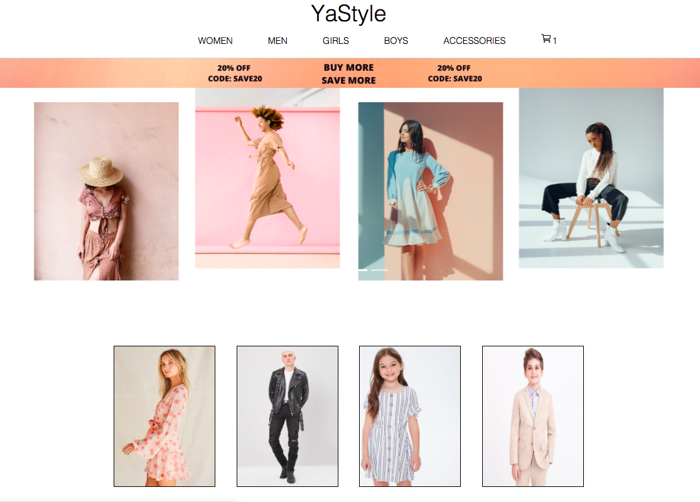

<ul>
  <li>Live DEMO can be found here: https://yastyle.netlify.app </li>
  <li>Version 2 is in-progress using Node.js, Javascript, MongoDB, Express, EJS, SCSS and it can be found <a href="https://github.com/soryaek/YaStyle_v2.git">HERE</a> </li>
</ul>
